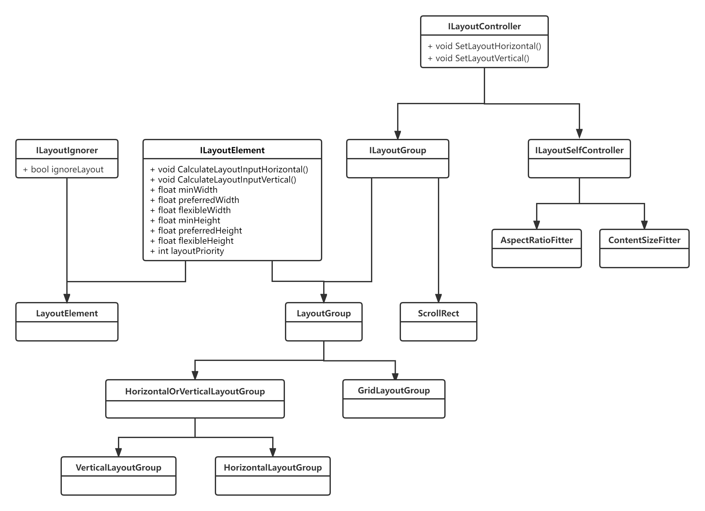

# LayoutRebuilder

LayoutRebuilder 是一个布局组件的管理类，通过调用 MarkLayoutForRebuild 函数

为指定的 RectTransform 注册到布局重建队列，从而在 PerformUpdate 函数中调用 Rebuild 函数

## MarkLayoutForRebuild函数

循环遍历重建的父节点是否是继承自 LayoutGroup，并且该组件处于激活状态

直到找到重建节点的根重建节点，标记该根重建节点为真正需要重建的节点

继承自 LayoutGroup 的组件有 GridLayoutGroup，VerticalLayoutGroup，HorizontalLayoutGroup

如果父节点中不存在需要重建的节点，判断自身是否可以重建

只有当节点继承自 ILayoutController 且组件处于激活状态时，标记该节点为重建的节点

继承自 ILayoutController 的组件有 AspectRatioFitter，ContentSizeFitter，ScrollRect

